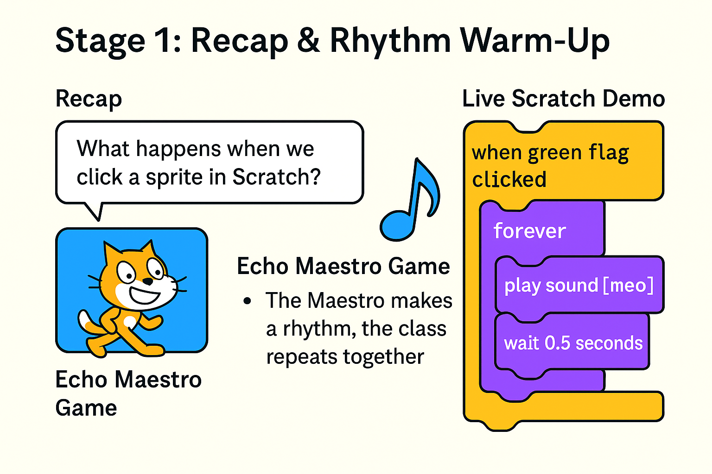
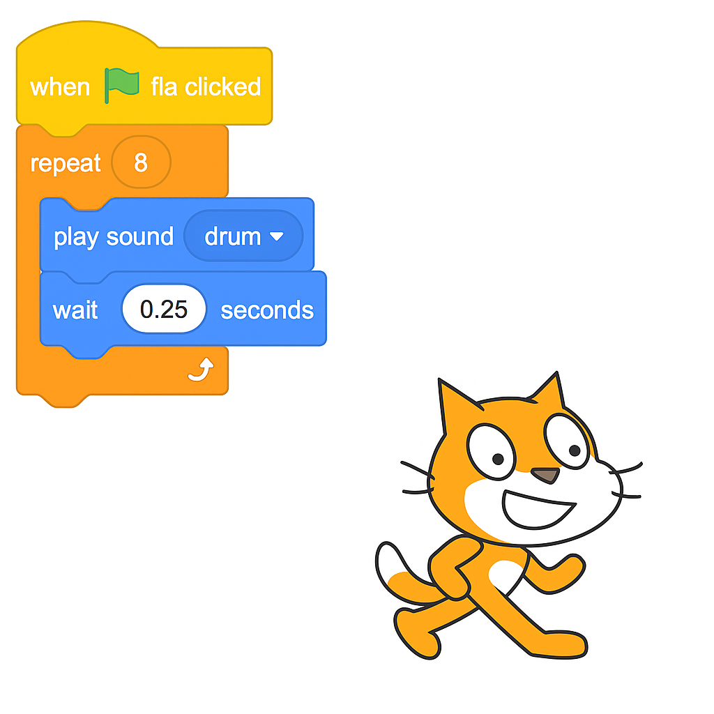
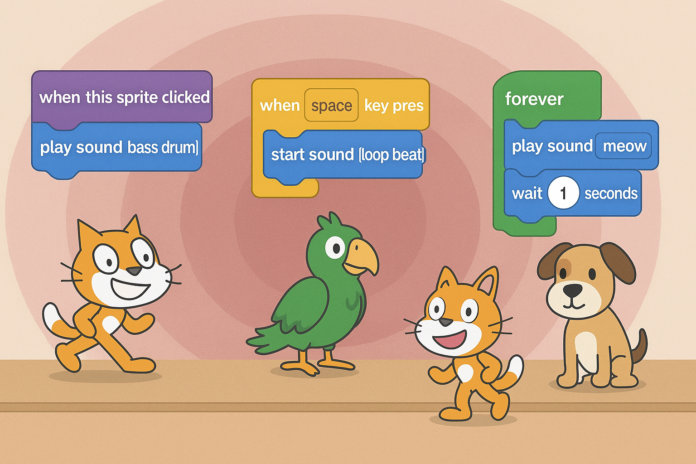

# 🎵 Lesson 4: The Scratch Sound Show

**Theme:** *"Code is your instrument — rehearse it, remix it, perform it!"*

## Goal

Students will explore how to create rhythm and performance using Scratch sound blocks and loops. They will learn to control timing, build patterns, and ultimately present their own mini-sound projects.

## Learning Model: Conscious Competence

| Stage | Name | Description |
|-------|------|-------------|
| 1️⃣ | Unconscious Incompetence | Spamming sound blocks without rhythm |
| 2️⃣ | Conscious Incompetence | Trying loops, but timing is off |
| 3️⃣ | Conscious Competence | Building sound patterns with loops and delays |
| 4️⃣ | Unconscious Competence | Creating and remixing sound behaviors freely |

---

## 🟡 Stage 1: Recap & Rhythm Warm-Up (15 min)

**Purpose:** Reconnect with prior lesson on events, spark curiosity with a rhythm game, and set up the idea of sound-based coding.

### 🎯 Learning Objectives

- Recall what events do in Scratch.
- Understand that rhythm needs timing.
- Experience how code can behave like music — or like noise.

---

### 🔁 Recap of Event Blocks

::: {.callout-note title="Ask the Class"}
- “What happens when we click a sprite in Scratch?”
- “What block do we use to make the sprite jump or talk?”
- “How can we make it react with sound?”

**Remind them:** Last time, they used `when clicked` and `when [key] pressed` to control how sprites react.
:::

---

### 🎵 Echo Maestro Spel

::: {.callout-note title="Speluitleg"}

**Voorbereiding:**

- Laat de leerlingen in een kring staan of naast hun bureau.
- Kies één leerling (of de leerkracht) als de **Echo Maestro**.

**Spelregels:**

1. De Maestro bedenkt een kort ritme met klappen, stampen, klikken of geluiden  
   *(bijvoorbeeld: Klap – Klap – Pauze – Stamp)*.
2. De rest van de klas luistert goed en **doet het ritme exact na**, in hetzelfde tempo.
3. Als het goed gaat, maakt de Maestro het iets moeilijker  
   *(sneller, extra klanken, onregelmatiger ritme)*.
4. Als het fout gaat, herhaal of keer terug naar een eenvoudiger patroon.
5. Na 2–3 rondes wordt een nieuwe Maestro gekozen.

**Variaties:**

- Gebruik klasmaterialen als instrumenten (potloden, tafels, blokjes).
- Voeg bewegingen toe zoals zwaaien, buigen of draaien (sprite-achtige acties).
- Gebruik klankwoorden (zoals *Boem – Tik – Plop*) en link deze aan Scratch-geluiden.

**Praktische tips:**

- Gebruik een hand omhoog of een ritmisch klapje om opnieuw te starten of tot stilte te komen.
- Wijs eventueel een “ritmewachter” aan die helpt het tempo te bewaken.

:::

---

### 🧠 Reflecteer met de Klas

::: {.callout-tip title="Koppel aan Scratch-logica"}

Stel vragen als:

- “Wat gebeurde er als iemand uit de maat ging?”
- “Was het moeilijker met een complexer ritme?”
- “Wat hielp om het goed te doen?”

Maak daarna de brug naar programmeren:

> “In Scratch is het net zo. Als je geen `wacht`-blok gebruikt, loopt je geluid door elkaar heen. Maar als je een goede `lus` gebruikt met timing, dan werkt je sprite net als jullie – op ritme, met controle.”

:::


---

### 🖥️ Live Scratch Demo

::: {.callout-note title="Show Bad Loop"}
Open Scratch and add this to the cat:

```
when green flag clicked
forever
  play sound [meow]
```

Ask: “What does this sound like? Is it a song?”

Then fix it:

```
when green flag clicked
forever
  play sound [meow]
  wait 0.5 seconds
```

Ask: “What changed? Why does it sound better?”

Finish with: “Now let’s code our own rhythm, like real composers!”
:::

{fig-align="center" width="60%"}
````

## 🟡 Stage 2: Guided Scratch Rehearsal (20 min)

**Purpose:** Build a structured rhythm loop in Scratch using `forever`, `repeat`, and `wait` blocks.

### 🎯 Learning Objectives

- Understand how loops and timing create rhythm.
- Practice Scratch syntax to control repetition and delay.
- Begin debugging and adjusting musical output.

---

### 🧑‍🏫 Teacher-Led Coding Demo

::: {.callout-note title="Build a Loop Together"}
Open Scratch and guide the class step-by-step:

**Option A: Repeating Drum Beat**

```
when green flag clicked
repeat 8
  play sound [drum]
  wait 0.25 seconds
```

**Option B: Forever Looping Snare**

```
when green flag clicked
forever
  play sound [snare drum]
  wait 0.4 seconds
```

Ask students:
- “What happens if we forget the `wait`?”
- “Can you hear the beat or is it too fast?”
:::

---

### 🛠️ Student Activity

::: {.callout-note title="Try It Yourself"}
Students build their own version using any of the following:

- `repeat` with a fixed number of beats
- `forever` for continuous rhythms
- Change sound type, wait time, and number of loops

Encourage students to:
- Test different delays (`0.2`, `0.5`, `1`)
- Combine sounds into short sequences
:::

{fig-align="center" width="60%"}

## 🟡 Stage 3: Creative Sound Projects (25 min)

**Purpose:** Students choose and build a sound-based mini-project.

### 🎯 Learning Objectives

- Apply loops, sounds, and timing in a self-directed creation.
- Combine input (clicks or key presses) with sound playback.
- Experiment and iterate like young musicians and coders.

---

### 🧩 Project Options

::: {.callout-note title="Let Students Choose One"}
- **Scratch Band:** Each sprite plays a different looped instrument.
- **Beatbox Machine:** Click on different sprites to trigger different sounds.
- **Interactive Instrument:** Press keys to play sounds with visual effects.
:::

---

### 🧠 Add Interactions (Optional)

```
when this sprite clicked
play sound [bass drum]
```

```
when [space key] pressed
start sound [loop beat]
```

Encourage layering:
- Background beat with a `forever` loop
- Click or key-activated melodies or effects

---

### 🛠️ Creativity Prompts

::: {.callout-tip title="Encourage Remixing"}
- “What happens if two sounds play together?”
- “Can your sprite ‘dance’ while it plays music?”
- “Can you change costume when a sound plays?”
:::

{fig-align="center" width="60%"}


## 🟡 Stage 4: The Scratch Sound Show (15 min)

**Purpose:** Showcase student work in a structured but fun “performance” or “gallery walk.”

### 🎯 Learning Objectives

- Reflect on creative choices through presentation.
- Celebrate student effort, experimentation, and rhythm.
- Practice giving and receiving positive peer feedback.

---

### 🎭 Presentation Options

::: {.callout-note title="Option 1: Gallery Walk"}
- Students leave their projects open.
- Walk around and try each other’s Scratch sound machines.
- Use sticky notes or “clap if you like it” feedback.

:::

::: {.callout-note title="Option 2: Stage Performance"}
- Select volunteers to plug in or present on the main screen.
- Introduce the performance: “Here’s my beat machine!”
- Play 30 seconds of each.

:::

---

### 💬 Feedback Prompts

::: {.callout-tip title="Ask or Post Questions Like:"}
- “What sounds did you use?”
- “Did you use `repeat` or `forever`?”
- “What would you add next?”
- “What was the trickiest part?”
:::


## 🟡 Stage 5: Reflection & Wrap-Up (10 min)

**Purpose:** Solidify learning and set up for next lesson.

### 🎯 Learning Objectives

- Reflect on creative problem-solving with sound and timing.
- Recognize how coding builds skill through rhythm, logic, and iteration.
- End the session with pride, confidence, and anticipation.

---

### 🗣️ Group Reflection

::: {.callout-note title="Ask the Class"}
- “What was your favorite sound or beat you made?”
- “What did your code do that surprised you?”
- “What was hard — and how did you solve it?”
- “Did someone else’s project inspire you?”
:::

---

### 🔁 Connect to Mastery

::: {.callout-tip title="Say This to the Class"}
"Today you weren’t just clicking blocks — you were coding like musicians. You turned chaos into rhythm, sound into logic, and Scratch into your own instrument."

"You rehearsed. You adjusted. You made choices. That’s what real creators do — and it’s exactly how game makers, artists, and engineers work."

"Every sound you made today started with a blank screen. And now, it’s something only you could’ve made."
:::

---

### 🚀 Next Step: Game Designers Assemble

> "Next week, we move from shows to **games**. You’ll build something that reacts, scores, challenges, and wins. All the skills you’ve used today — loops, events, sound — will power your first real game."

---

### ✏️ Optional Homework

Draw or describe your game idea:
- What’s the goal?
- What makes it fun?
- What sounds or reactions does it have?

:::
Bring your idea next time — it’s time to **code your first game.**
:::


